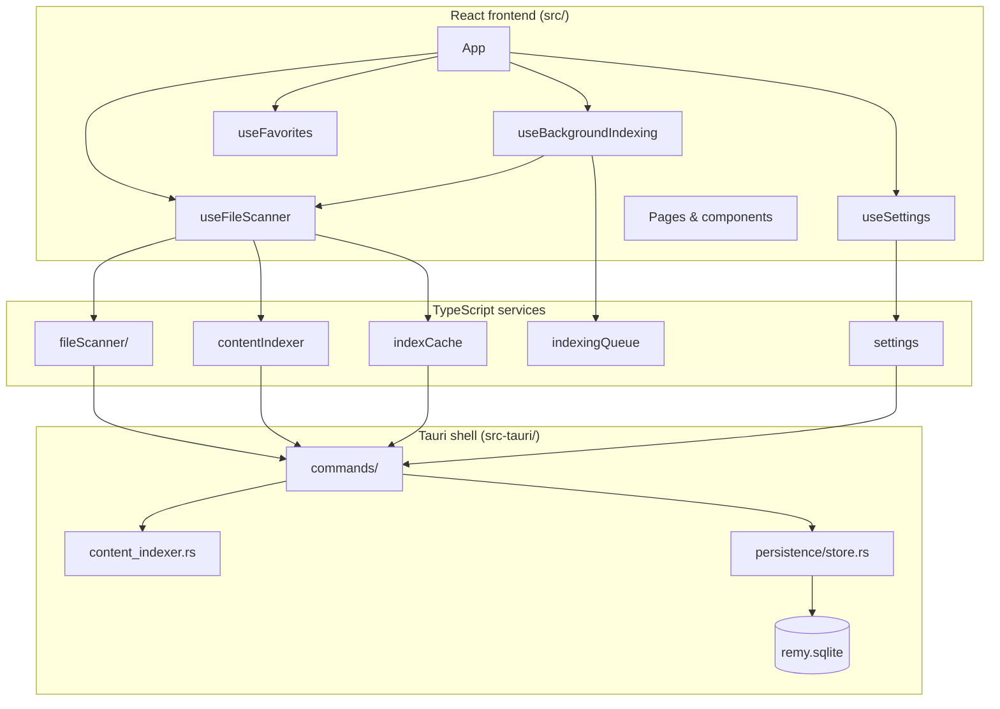
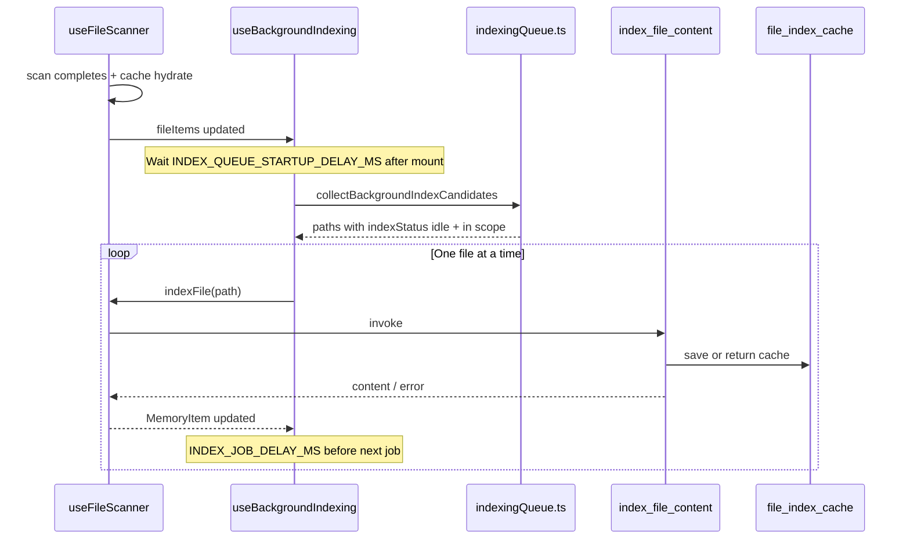

# Remy — Architecture

Design reference for how Remy’s major subsystems fit together. For product context see `PROJECT_CONTEXT.md`; for priorities see `ROADMAP.md`.

## High-level layers



## File discovery & timeline

1. **`useFileScanner`** runs on an interval (default 5s) and invokes `scan_all_memory_folders` with folder enable flags from settings.
2. Scan results are merged into in-memory **`MemoryItem[]`** via `mergeScanResults`, preserving index state for paths already known.
3. **`lookup_file_index_cache`** hydrates cached text for scanned paths (async, post-scan) so the UI is not blocked.
4. Clipboard polling runs on a separate interval (default 2s) and merges into the same timeline.

## Content indexing

### Manual indexing

User opens a file in the details panel and clicks **Index Content**, **Reindex**, or **Clear index**.

- **`indexFile(path, { force? })`** in `useFileScanner` calls Tauri `index_file_content`.
- Rust extracts text (txt / pdf / docx, max ~200k chars), saves to `file_index_cache`, returns content.
- Frontend updates `MemoryItem.indexStatus`, `content`, `indexedCharCount`, `indexedAt`.
- Cache invalidation uses file mtime + size; unchanged files skip re-extraction unless `force: true`.

### Background indexing queue

Automatic indexing for newly discovered files without blocking the UI.



| Rule | Behavior |
|------|----------|
| Eligible status | `idle` only (not indexed). Failed (`error`) files are **not** auto-retried; user uses manual Index Content. |
| Already indexed | Skipped (`indexed` or cache hydrate sets status before queue runs). |
| Concurrency | One file at a time; `indexingPathsRef` prevents duplicate work with manual indexing. |
| Startup | Queue worker starts after `INDEX_QUEUE_STARTUP_DELAY_MS` (200ms) so first paint is not blocked. |
| Between jobs | `INDEX_JOB_DELAY_MS` (750ms) keeps the main thread responsive. |
| Failure | Item marked `error`; queue continues; app does not crash. |
| Clear index | Status returns to `idle`; path is eligible again on next enqueue pass. |
| Scope | Settings: TXT only · TXT+DOCX · TXT+DOCX+PDF (`background_index_scope`). |
| Enable | Settings toggle `background_indexing_enabled`; when off, status shows **Paused**. |

### Queue state (UI)

**`IndexingQueueStatus`** displays:

- Paused / Running
- Current file name (while indexing)
- Queued count
- Indexed count (files with `indexStatus === 'indexed'` in current scan)

Shown in the **sidebar** (compact) and **Settings → Background indexing** (full grid).

### Indexing recovery (Settings)

| Action | Effect |
|--------|--------|
| **Clear all indexed content** | `DELETE FROM file_index_cache`; in-memory `MemoryItem` fields reset (`indexStatus` → idle, content cleared, metadata zeroed); Indexed page updates immediately; also resets the background queue |
| **Reset indexing queue** | Cancels in-flight background worker generation; clears pending queue and session counters; status → Idle (or Disabled if background indexing off); **does not** delete cached index text |

Both actions require confirmation and show a success banner.

## Persistence

| Table / key | Purpose |
|---------------|---------|
| `file_index_cache` | Extracted text, mtime, size, `indexed_at_ms` |
| `app_settings` | JSON blob including `background_indexing_enabled`, `background_index_scope` |
| `clipboard_entries` | Clipboard history |
| `favorites` | Pinned memory snapshots |

Location: `{data_local_dir}/com.remy.app/remy.sqlite`

## Settings flow

```mermaid
flowchart LR
  SettingsPage --> useSettings
  useSettings --> saveAppSettings
  saveAppSettings --> get_app_settings / save_app_settings
  save_app_settings --> SQLite
  useSettings --> useFileScanner
  useSettings --> useBackgroundIndexing
```

Background indexing settings persist in the same `app_settings` row as scan and clipboard options. Browser dev mode uses `localStorage` (`remy-app-settings`).

## Key files (background indexing)

| File | Role |
|------|------|
| `src/services/indexingQueue.ts` | Eligibility checks, candidate collection, constants |
| `src/hooks/useBackgroundIndexing.ts` | Queue worker, state for UI |
| `src/components/IndexingQueueStatus.tsx` | Queue status display |
| `src/types/settings.ts` | `backgroundIndexingEnabled`, `backgroundIndexScope` |
| `src-tauri/src/persistence/settings.rs` | Rust DTO + serde defaults for new fields |
| `src/services/settings.ts` | TS ↔ Rust settings mapping |

## Explicit non-goals

- No AI / embeddings / semantic search
- No OCR (PDF text extraction only where embedded text exists)
- No cloud sync
