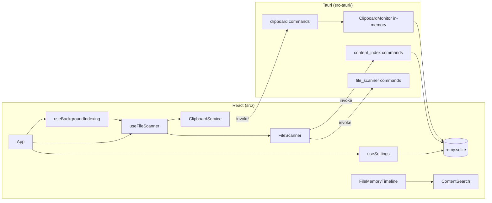

# Remy — Project Context

## What Remy is

**Remy** is a local-first desktop application that acts as a **second memory** for your computer. It surfaces files and clipboard history you have touched recently, lets you search across them, and keeps everything on-device.

Tagline (in-app): *Your second memory — files and clipboard.*

## Principles

| Principle | Meaning |
|-----------|---------|
| **Local-first** | Data stays on the user’s machine. No cloud sync or remote database in the current design. |
| **Passive capture** | Remy watches standard folders and the clipboard rather than requiring manual “save to Remy” for every item. |
| **Searchable memory** | File metadata is always available; text inside supported files can be indexed for full-text search. |
| **Desktop-native** | File reveal, open, and clipboard actions use OS integrations via Tauri plugins. |

## Tech stack

| Layer | Stack |
|-------|--------|
| **UI** | React 19, TypeScript, Tailwind CSS 4, Vite 8 |
| **Shell** | Tauri 2 (Rust) — `src-tauri/` |
| **Plugins** | `tauri-plugin-fs`, `tauri-plugin-opener`, `tauri-plugin-clipboard-manager` |
| **Rust deps** | `pdf-extract`, `zip` + `quick-xml` (DOCX), `arboard` (clipboard polling) |

## Repository layout

```
Remy/
├── src/                    # React frontend
│   ├── components/         # UI (Sidebar, timeline, Settings, cards, search)
│   ├── hooks/              # useFileScanner, useSettings, useBackgroundIndexing
│   ├── services/           # Tauri/mock adapters, clipboard, indexing, indexingQueue
│   ├── lib/                # Search, formatting, Tauri detection, `imageSrc` (asset URLs)
│   └── types/              # MemoryItem, NavSection, etc.
├── src-tauri/
│   ├── src/
│   │   ├── commands/       # Tauri invoke handlers
│   │   ├── persistence/    # SQLite local store (clipboard + index cache)
│   │   ├── clipboard_monitor.rs
│   │   └── content_indexer.rs
│   └── tauri.conf.json     # `assetProtocol` scope for image thumbnails (Downloads/Desktop/Documents)
├── package.json
├── PROJECT_CONTEXT.md      # This file
├── ARCHITECTURE.md         # System design (indexing queue, persistence, data flow)
└── ROADMAP.md
```

## Architecture



### Frontend

- **`useFileScanner`**: Polls Downloads, Desktop, and Documents every 5s; polls clipboard every 2s when running in Tauri. Merges file + clipboard items into one timeline. After each file scan, asynchronously restores cached index text from disk (non-blocking UI). Exposes `indexFile` for manual and background indexing.
- **`useBackgroundIndexing`**: After initial UI render (~200ms), enqueues indexable files with `indexStatus === 'idle'` and processes them one at a time via `indexFile`, with a 750ms delay between jobs. Respects Settings toggles for enable/disable and file-type scope (TXT / TXT+DOCX / TXT+DOCX+PDF). Skips already-indexed and failed files; re-queues after “Clear index”. Queue status shown in the sidebar and Settings.
- **`FileScanner` + adapters**: `TauriFileSystemAdapter` (production) or `MockFileSystemAdapter` (Vite-only browser dev).
- **`contentSearch`**: Client-side filter by name, path, extension, type, source, and indexed/plain text.
- **Navigation**: `Timeline`, `Memories`, `Favorites`, `Indexed`, and `Settings` are implemented; `Search` is routed in the shell but not built yet.
- **Indexed page**: Filtered view of live items with `indexStatus === 'indexed'` and extracted text (txt/pdf/docx from all scan sources); no source filters.
- **`useFavorites`**: Independent favorites collection in SQLite (`favorites` table: `memory_id` + JSON snapshot per pin); `useFileScanner` marks live items with `isFavorite`; Favorites page uses `resolveFavoriteItems()` to merge live scan data with saved snapshots — no duplicate rows.
- **Memories page**: Database-style browse of all items (list/grid, type filters, sort, search); preferences (view mode, sort) persist in `localStorage`. Timeline remains the chronological activity feed with source filters unchanged.
- **`useSettings`**: Loads/saves app preferences (folder toggles, poll intervals, clipboard privacy, background indexing) via SQLite in Tauri or `localStorage` in browser mock.

### Backend (Rust)

| Command | Role |
|---------|------|
| `get_allowed_paths` | Resolve Downloads / Desktop / Documents via `dirs` |
| `scan_all_memory_folders` | List supported files in those directories |
| `index_file_content` | Extract text from `.txt`, `.pdf`, `.docx` (max ~200k chars) |
| `poll_clipboard` / `get_clipboard_entries` | Track text clipboard (dedupe window 30s, max 500 entries); persisted to SQLite |
| `index_file_content` | Extract text; reads/writes `file_index_cache` (invalidates on mtime/size change) |
| `lookup_file_index_cache` | Batch restore cached index text for scanned paths (startup hydration) |
| `hydrate_clipboard_history` | Reload clipboard rows from disk into memory (optional; also runs at app setup) |
| `get_app_settings` / `save_app_settings` | Read/write user preferences (JSON in `app_settings`) |
| `get_memory_statistics` | Clipboard count, indexed file count, total indexed characters (SQLite) |
| `clear_file_index` | Remove one file’s cached index (per-file “Clear index”) |
| `index_file_content` | Optional `force` skips cache for reindex |
| `get_favorites` / `set_favorite` | Persist pinned memories (`memory_id` + metadata snapshot JSON) |
| `clear_clipboard_history` / `clear_indexed_content` | Privacy / recovery — clear clipboard history or all cached index text |
| `scan_all_memory_folders` | Accepts per-folder enable flags from settings |

### Local persistence (Phase 1.2)

| Store | Location | Contents |
|-------|----------|----------|
| **SQLite** (`rusqlite`, bundled) | `{data_local_dir}/com.remy.app/remy.sqlite` | `clipboard_entries`, `file_index_cache`, `favorites`, `app_settings` |

- **Clipboard**: Saved after each successful poll; restored into `ClipboardMonitor` on startup (dedupe state seeded from newest entry).
- **Index cache**: Keyed by `file_path`; validated with `file_mtime_ms` + `file_size` so changed files are re-indexed on demand.
- **Indexed content source of truth** (read this when debugging clear/search/indexed views):
  - **Persistent store (Tauri)**: SQLite table `file_index_cache` — columns `file_path`, `content`, `file_mtime_ms`, `file_size`, `indexed_at_ms`. Written by `index_file_content`; wiped by `clear_indexed_content` or per-file `clear_file_index`. **Not** stored in `localStorage`.
  - **Runtime store (UI)**: React state `fileItems` in `useFileScanner`, merged into `items` (files + clipboard). Each file’s `content`, `indexStatus`, `indexedCharCount`, and `indexedAt` fields are what Timeline, Memories, Search, and Indexed read.
  - **Hydration path**: After each folder scan, `lookup_file_index_cache` loads SQLite rows into `fileItems` via `applyIndexCache`. This can re-populate indexed state after a clear if hydration races — `clearAllIndexedContent` bumps a hydration epoch and re-checks it inside the `setFileItems` callback.
  - **Indexed page filter**: `resolveIndexedItems(items)` → `isIndexedFile(item)` requires `indexStatus === 'indexed'` **and** non-empty `content`. Same `items` array powers Timeline/Memories search via `contentSearch.ts`.
  - **Clear all indexed content** must: (1) stop background worker + set `backgroundIndexingEnabled: false`, (2) `DELETE FROM file_index_cache` (twice, bracketing in-flight index ops), (3) reset every file in `fileItems` to `indexStatus: 'idle'` with null content/metadata, (4) set `indexHydrationBlockedRef` for the session so scan hydration cannot re-apply cache. Settings **Index debug** shows React indexed count vs SQLite row count.
- **Local-first only** — no network, no cloud APIs.
- **Settings**: Single row `app_settings` key `app_settings` stores JSON (`scan_*`, poll intervals, `clipboard_enabled`, `background_indexing_enabled`, `background_index_scope`). Defaults seeded on first DB open.
- **Startup**: Clipboard hydrate runs in Tauri `setup` (fast SQLite read). Index cache hydrate runs in the frontend after the first folder scan via `lookup_file_index_cache` (async, does not block the initial render). Background indexing queue starts ~200ms after first paint (does not block startup).

## Data model

### `MemoryItem`

Unified shape for files and clipboard snippets:

- **Sources**: `Downloads`, `Desktop`, `Documents`, `Clipboard`
- **Types**: `PDF`, `Image`, `Text`, `Document`, `Spreadsheet`, `Archive`, `Clipboard`
- **Supported file extensions**: `pdf`, `png`, `jpg`, `jpeg`, `webp`, `txt`, `docx`, `xlsx`, `csv`, `zip`
- **Indexable for search**: `txt`, `pdf`, `docx` (`indexStatus`: `idle` | `loading` | `indexed` | `error`; UI labels: Not indexed / Indexed / Failed)
- **Index metadata** (files): `indexedCharCount`, `indexedAt` — persisted in `file_index_cache.indexed_at_ms` with extracted text
- **Favorites**: `isFavorite` on live items; persisted collection keyed by stable `MemoryItem.id` (file path or `clipboard://…`) with snapshot JSON for display when not in the current scan
- **Image thumbnails**: `png`, `jpg`, `jpeg`, `webp` use `MemoryItem.filePath` via Tauri `convertFileSrc` (asset protocol); 64×64 lazy previews on Timeline, Memories, Favorites, and Indexed cards (browser dev shows type icons only)

### UI sections (`NavSection`)

`Timeline` · `Memories` · `Favorites` · `Indexed` · `Search` · `Settings`

## Current capabilities (implemented)

- Dark, Linear-inspired layout: sidebar, global search bar, timeline and Memories browse views
- Real folder scanning on macOS/Windows/Linux (via Tauri)
- Clipboard text capture with deduplication (persisted across restarts)
- Indexed file text cache on disk (skip re-extraction when file unchanged)
- **Timeline**: source filter (All / per-folder / Clipboard), chronological layout; image files show 64×64 thumbnails when running in Tauri
- **Memories**: type filter (All / Files / Clipboard / PDF / DOCX / TXT / Images), list or grid, six sort orders, detail panel on select
- **Favorites** sidebar: dedicated page listing all pinned items from every source (no source filters); star toggle on Timeline/Memories cards and details panel
- **Indexed** sidebar: dedicated page for files with cached extracted text (Downloads, Desktop, Documents); search, sort, index metadata on cards
- Timeline search with highlighted snippets
- Detail panel: Index Content / Reindex / Clear index for txt·pdf·docx; index status (Not indexed / Indexed / Failed), character count, timestamp; open / reveal / copy path
- **Background indexing**: off by default; optional queue for TXT/DOCX (configurable scope); session limits; queue status in sidebar and Settings
- **Indexing recovery** (Settings → Background indexing): **Clear all indexed content** (SQLite + in-memory reset) and **Reset indexing queue** (stop pending jobs, keep indexed files)
- Settings statistics: indexed file count and total indexed characters
- Mock timeline when running `npm run dev` without Tauri
- **Settings** page: folder scan toggles, poll intervals, clipboard privacy, background indexing (enable + file-type scope + recovery actions), clear clipboard history, live statistics and queue status

## Development

```bash
# Web UI only (mock data)
npm run dev

# Full desktop app
npm run tauri:dev

# Production build
npm run tauri:build
```

Lint: `npm run lint`

## Explicit non-goals (for now)

- Cloud sync or multi-device accounts
- LLM / semantic search / “AI memory” (see ROADMAP for future consideration)
- Browser history or screenshot capture pipelines (not wired up yet)

## Conventions for contributors

- Match existing patterns: service adapters for Tauri vs mock, snake_case DTOs from Rust, camelCase in TypeScript mappers.
- Keep invoke surface small; add Rust commands under `src-tauri/src/commands/`.
- Prefer extending `MemoryItem` and `searchMemoryItems` over one-off filters in components.
- UI copy and styling use Tailwind tokens (`remy-*` in `index.css`).

When starting a new chat or agent session, read this file, `ARCHITECTURE.md`, and `ROADMAP.md` for scope and priorities.
