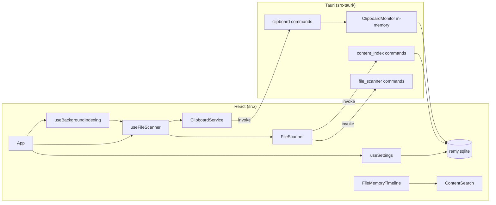

# Remy — Project Context

## What Remy is

**Remy** is a local-first desktop application that acts as a **second memory** for your computer. It surfaces files and clipboard history you have touched recently, lets you search across them, and keeps everything on-device.

Tagline (in-app): *Your second memory — files and clipboard.*

## Principles

| Principle | Meaning |
|-----------|---------|
| **Local-first** | Data stays on the user’s machine. No cloud sync or remote database in the current design. |
| **Passive capture** | Remy watches standard folders and the clipboard rather than requiring manual “save to Remy” for every item. |
| **Searchable memory** | File metadata is always available; text inside supported files can be indexed for full-text search. |
| **Desktop-native** | File reveal, open, and clipboard actions use OS integrations via Tauri plugins. |

## Tech stack

| Layer | Stack |
|-------|--------|
| **UI** | React 19, TypeScript, Tailwind CSS 4, Vite 8 |
| **Shell** | Tauri 2 (Rust) — `src-tauri/` — features: `protocol-asset`, `tray-icon` |
| **Plugins** | `tauri-plugin-fs`, `tauri-plugin-opener`, `tauri-plugin-clipboard-manager`, `tauri-plugin-dialog`, `tauri-plugin-notification`, `tauri-plugin-autostart` (macOS launch at login), `tauri-plugin-global-shortcut` (desktop global hotkey) |
| **Rust deps** | `pdf-extract`, `zip` + `quick-xml` (DOCX), `ocrs` + `rten` (image OCR), `image`, `arboard` (clipboard polling) |

## Repository layout

```
Remy/
├── src/                    # React frontend
│   ├── components/         # UI (Sidebar, timeline, Settings, cards, QuickSearchOverlay)
│   ├── hooks/              # useFileScanner, useSettings, useWatchedFolders, useBackgroundIndexing
│   ├── services/           # Tauri/mock adapters, clipboard, indexing, indexingQueue
│   ├── lib/                # Search, formatting, Tauri detection, `quickSearchContext`, `quickSearchRecentActivity`
│   └── types/              # MemoryItem, NavSection, etc.
├── src-tauri/
│   ├── src/
│   │   ├── commands/       # Tauri invoke handlers
│   │   ├── persistence/    # SQLite local store (clipboard + index cache)
│   │   ├── clipboard_monitor.rs
│   │   ├── content_indexer.rs
│   │   ├── ocr_engine.rs        # ocrs neural OCR for png/jpg/jpeg/webp
│   │   ├── background_mode.rs   # hide-on-close, prevent exit, dock reopen
│   │   ├── launch_at_login.rs   # macOS Launch Agent autostart, --background-launch
│   │   ├── global_hotkey.rs     # Cmd+Shift+Space → quick search overlay
│   │   ├── quick_search.rs      # Spotlight-style overlay window show/hide/focus
│   │   └── tray.rs              # macOS menu bar / system tray icon + menu
│   └── tauri.conf.json     # `assetProtocol` scope for image thumbnails (Downloads/Desktop/Documents)
├── package.json
├── PROJECT_CONTEXT.md      # This file
├── ARCHITECTURE.md         # System design (indexing queue, persistence, data flow)
└── ROADMAP.md
```

## Architecture



### Frontend

- **`useFileScanner`**: Polls enabled default folders (Downloads, Desktop, Documents) plus user-added custom watch folders every 5s; polls clipboard every 2s when running in Tauri. Merges file + clipboard items into one timeline. After each file scan, asynchronously restores cached index text from disk (non-blocking UI). Exposes `indexFile` for manual and background indexing.
- **`useBackgroundIndexing`**: After initial UI render (~2s), enqueues indexable files with `indexStatus === 'idle'` and processes them **one at a time** via `indexFile`. TXT/DOCX: 5s between jobs, max 10MB. **OCR image indexing is postponed** (`OCR_INDEXING_ENABLED = false` in `src/lib/ocrFeature.ts` and `ocr_engine.rs`) — no OCR on startup, scan, or background queue. **PDF is off by default** — separate Settings toggle with max size (default 5MB), delay (default 10s), 60s Rust extraction timeout, and panic isolation. Failed PDF jobs get `indexStatus === 'error'` and are not retried in the same session. Queue status shown in the sidebar and Settings.
- **`FileScanner` + adapters**: `TauriFileSystemAdapter` (production) or `MockFileSystemAdapter` (Vite-only browser dev).
- **`contentSearch`**: Client-side filter by name, path, extension, type, source, indexed/plain text, and **`tag:`** filters (e.g. `tag:crypto`, `ethereum tag:crypto`).
- **`quickSearchRecentActivity`**: Builds Recent Activity sections for Quick Search (Recent Files, Recent Clipboard, Favorites); refreshed on overlay open.
- **`quickSearchContext`**: Context chips (**All**, **Recent**, **Clipboard**, **Favorites**, **Tags**) under the overlay search input; each mode scopes browse and search (`resolveQuickSearchRows`). **All** uses live union of files, clipboard, favorites, and tag pills (not a stale snapshot). **Recent** shows recent files + clipboard only. Esc hides overlay via window-level capture handler.
- **Navigation**: `Timeline`, `Favorites`, `Indexed`, and `Settings` are implemented; `Search` is not built yet.
- **Onboarding & empty states**: True first launch (no files, no clipboard entries in SQLite, no favorites, scan/favorites loaded) opens a one-time **modal** (`OnboardingModal`). Dismissal or action (Scan now / Add Folder) sets `localStorage` flag `remy.onboardingCompleted` — never shown again. Timeline stays search + toolbar + content only (no inline welcome card). Section empty states share an `EmptyState` component. Dev: **Preview empty states** (`remy.previewEmptyStates`) and **Reset onboarding** in Settings → Developer.
- **Indexed page**: Filtered view of live items with `indexStatus === 'indexed'` and extracted text (txt/pdf/docx from all scan sources); no source filters.
- **`useFavorites`**: Independent favorites collection in SQLite (`favorites` table: `memory_id` + JSON snapshot per pin); `useFileScanner` marks live items with `isFavorite`; Favorites page uses `resolveFavoriteItems()` to merge live scan data with saved snapshots — no duplicate rows.
- **`useTags`**: Independent tag assignments in SQLite (`tags` + `memory_tags` tables); keyed by stable `MemoryItem.id` (file path or `clipboard://…`); `useFileScanner` attaches `tags[]` to live items via `applyTagsToItems`; survives rescans/reindexing because tags are stored separately from scan/index cache.
- **Memories page**: Database-style browse of all items (list/grid, type filters, sort, search); preferences (view mode, sort) persist in `localStorage`. Timeline remains the chronological activity feed with source filters unchanged.
- **`useSettings`**: Loads/saves app preferences (default folder toggles, custom watch folder paths, poll intervals, clipboard privacy, background indexing, launch at login, run in background when window closed) via SQLite in Tauri or `localStorage` in browser mock. Listens for `settings-changed` events from the tray menu to reload after tray toggles background indexing.

### Backend (Rust)

| Command | Role |
|---------|------|
| `get_allowed_paths` | Resolve Downloads / Desktop / Documents via `dirs` |
| `scan_all_memory_folders` | List supported files in enabled default folders plus `custom_watched_folders` from settings |
| `register_watched_folder_scopes` | Extend asset-protocol scope for thumbnails in watched folders |
| `open_file_path` / `reveal_file_path` | OS open/reveal for any watched path (including custom folders) |
| `index_file_content` | Extract text from `.txt`, `.pdf`, `.docx` (max ~200k chars). OCR images disabled at compile-time flag. PDF runs in an isolated thread with **60s timeout** and **`catch_unwind`**. |
| `poll_clipboard` / `get_clipboard_entries` | Track text clipboard (dedupe window 30s, max 500 entries); persisted to SQLite |
| `lookup_file_index_cache` | Batch restore cached index text for scanned paths (startup hydration) |
| `hydrate_clipboard_history` | Reload clipboard rows from disk into memory (optional; also runs at app setup) |
| `get_app_settings` / `save_app_settings` | Read/write user preferences (JSON in `app_settings`, includes `custom_watched_folders`) |
| `get_memory_statistics` | Clipboard count, indexed file count, total indexed characters (SQLite) |
| `clear_file_index` | Remove one file’s cached index (per-file “Clear index”) |
| `get_favorites` / `set_favorite` | Persist pinned memories (`memory_id` + metadata snapshot JSON) |
| `get_memory_tag_assignments` / `add_memory_tag` / `remove_memory_tag` | Load and mutate tag assignments (separate from index cache) |
| `get_tag_statistics` | Tag count and top 10 most-used tags |
| `clear_clipboard_history` / `clear_indexed_content` | Privacy / recovery — clear clipboard history or all cached index text |
| `get_global_hotkey_status` | Whether `Cmd + Shift + Space` registered successfully (for Settings warning) |
| `hide_quick_search_overlay` | Hide the `quick-search` overlay window |
| `open_memory_in_main_app` | Hide overlay, show main window, emit `open-memory-in-main` with item id + file name |

**Background mode, menu bar & global hotkey:**

| Module | Role |
|--------|------|
| `background_mode.rs` | On window close (when `run_in_background_when_closed`): `prevent_close`, hide window, one-time system notification; `ExitRequested` without quit code → `prevent_exit`; macOS Dock click → show main window |
| `launch_at_login.rs` | macOS Launch Agent via `tauri-plugin-autostart`; registers login item with `--background-launch` arg; hides main window on autostart launch; syncs login item when `launch_at_login` setting changes |
| `tray.rs` | Menu bar icon (bundled app icon, template on macOS); menu: Open Remy, Scan now, background indexing toggle, stats, Quit; emits `tray-scan-now` and `settings-changed` to the webview |
| `global_hotkey.rs` | Registers `Command+Shift+Space` via `tauri-plugin-global-shortcut`; on press opens the **quick-search** overlay (fallback: main window + header search focus) |
| `quick_search.rs` | Manages the `quick-search` Tauri window: show/center/focus, hide, close→hide handler, `open_memory_in_main_app` command |

**Tauri events (Rust → frontend):**

| Event | Frontend handler | Effect |
|-------|------------------|--------|
| `tray-scan-now` | `App.tsx` | Calls `memoryScan.refresh()` (same as Timeline “Scan now”) |
| `settings-changed` | `useSettings` | Reloads settings from SQLite after tray toggles background indexing |
| `focus-global-search` | `App.tsx` | Focuses header search (fallback when overlay unavailable) |
| `focus-quick-search` | `QuickSearchOverlay.tsx` | Clears query, refreshes Recent Activity snapshot, and focuses overlay search input (after global hotkey) |
| `open-memory-in-main` | `App.tsx` | Shows main window with Timeline search prefilled (Cmd+Enter in overlay) |

Background capture (file poll, clipboard poll, indexing queue) stays in the React webview. Hiding the window does **not** destroy the webview, so existing `setInterval` loops keep running unchanged.

### Local persistence (Phase 1.2)

| Store | Location | Contents |
|-------|----------|----------|
| **SQLite** (`rusqlite`, bundled) | `{data_local_dir}/com.remy.app/remy.sqlite` | `clipboard_entries`, `file_index_cache`, `favorites`, `tags`, `memory_tags`, `app_settings` |

- **Clipboard**: Saved after each successful poll; restored into `ClipboardMonitor` on startup (dedupe state seeded from newest entry).
- **Index cache**: Keyed by `file_path`; validated with `file_mtime_ms` + `file_size` so changed files are re-indexed on demand.
- **Indexed content source of truth** (read this when debugging clear/search/indexed views):
  - **Persistent store (Tauri)**: SQLite table `file_index_cache` — columns `file_path`, `content`, `file_mtime_ms`, `file_size`, `indexed_at_ms`. Written by `index_file_content`; wiped by `clear_indexed_content` or per-file `clear_file_index`. **Not** stored in `localStorage`.
  - **Runtime store (UI)**: React state `fileItems` in `useFileScanner`, merged into `items` (files + clipboard). Each file’s `content`, `indexStatus`, `indexedCharCount`, and `indexedAt` fields are what Timeline, Memories, Search, and Indexed read.
  - **Hydration path**: After each folder scan, `lookup_file_index_cache` loads SQLite rows into `fileItems` via `applyIndexCache`.
  - **Indexed page filter**: `resolveIndexedItems(items)` → `isIndexedFile(item)` requires `indexStatus === 'indexed'` **and** non-empty `content`. Same `items` array powers Timeline/Memories search via `contentSearch.ts`.
  - **Failed indexing**: `indexStatus === 'error'` with `indexError` message on the memory item (UI label: Failed). Background queue skips non-`idle` files; attempted paths are remembered for the session so failures are not retried automatically.
- **Local-first only** — no network, no cloud APIs.
- **Settings**: Single row `app_settings` key `app_settings` stores JSON (`scan_*`, `custom_watched_folders`, poll intervals, `clipboard_enabled`, `background_indexing_enabled`, `background_index_scope`, `background_pdf_indexing_enabled`, `background_pdf_max_size_mb`, `background_pdf_delay_sec`, `ocr_image_indexing_enabled`, `launch_at_login`, `run_in_background_when_closed`). Defaults seeded on first DB open. Meta flag `background_close_notification_shown` tracks the one-time hide notification.
- **Startup**: Clipboard hydrate runs in Tauri `setup` (fast SQLite read). Index cache hydrate runs in the frontend after the first folder scan via `lookup_file_index_cache` (async, does not block the initial render). Background indexing queue starts ~200ms after first paint (does not block startup).

## Data model

### `MemoryItem`

Unified shape for files and clipboard snippets:

- **Sources**: `Downloads`, `Desktop`, `Documents`, `Clipboard`, plus custom folder display names (folder basename, e.g. `Projects`)
- **Types**: `PDF`, `Image`, `Text`, `Document`, `Spreadsheet`, `Archive`, `Clipboard`
- **Supported file extensions**: `pdf`, `png`, `jpg`, `jpeg`, `webp`, `txt`, `docx`, `xlsx`, `csv`, `zip`
- **Indexable for search**: `txt`, `pdf`, `docx` (images: thumbnails only; OCR postponed)
- **Index metadata** (files): `indexedCharCount`, `indexedAt` — persisted in `file_index_cache.indexed_at_ms` with extracted text
- **Favorites**: `isFavorite` on live items; persisted collection keyed by stable `MemoryItem.id` (file path or `clipboard://…`) with snapshot JSON for display when not in the current scan
- **Tags**: `tags: string[]` on live items; persisted in `memory_tags` keyed by the same stable `memory_id`; normalized lowercase names (optional `#` prefix in UI); independent from favorites and index cache
- **Image thumbnails**: `png`, `jpg`, `jpeg`, `webp` use `MemoryItem.filePath` via Tauri `convertFileSrc` (asset protocol); 64×64 lazy previews on Timeline, Memories, Favorites, and Indexed cards (browser dev shows type icons only)

### UI sections (`NavSection`)

`Timeline` · `Memories` · `Favorites` · `Indexed` · `Search` · `Settings`

## Current capabilities (implemented)

- Dark, Linear-inspired layout: sidebar, global search bar, timeline browse view
- **First-launch onboarding**: one-time modal on pristine install (Scan now / Add Folder); Timeline layout unchanged after dismiss
- **Empty states**: Shared `EmptyState` on Timeline (“No memories yet” + Add Folder / Scan now), Favorites, and Indexed; item-count footers hidden when lists are empty. Timeline layout is search → toolbar → content only (no inline onboarding card).
- Real folder scanning on macOS/Windows/Linux (via Tauri)
- Clipboard text capture with deduplication (persisted across restarts)
- Indexed file text cache on disk (skip re-extraction when file unchanged)
- **Timeline**: **Folders** row (All / default folders / custom folders / + Add Folder) filters the feed; type, view, and sort controls below; image files show 64×64 thumbnails when running in Tauri
- **`useWatchedFolders`**: Add/remove custom watch folders from Timeline (native folder picker in Tauri); persists via `useSettings`
- **Memories**: type filter (All / Files / Clipboard / PDF / DOCX / TXT / Images), list or grid, six sort orders, detail panel on select
- **Favorites** sidebar: dedicated page listing all pinned items from every source (no source filters); star toggle on Timeline/Memories cards and details panel
- **File tags (Phase 1)**: custom tags on any memory item; details panel Tags section with pills, **+ Add Tag** (create or assign existing), remove per tag; Timeline optional tag filter row (All + top tags); search supports `tag:name` and combined queries (`ethereum tag:crypto`); Quick Search overlay uses the same `contentSearch` rules; Settings shows tag count and most-used tags
- **Indexed** sidebar: dedicated page for files with cached extracted text (Downloads, Desktop, Documents); search, sort, index metadata on cards
- Timeline search with highlighted snippets
- Detail panel: Index Content / Reindex / Clear index for txt·pdf·docx; open / reveal / copy path (image OCR controls hidden while postponed)
- **Background indexing**: off by default; optional queue for TXT/DOCX (configurable scope) and PDF; OCR not queued; session limits; queue status in sidebar and Settings
- **Indexing recovery** (Settings → Background indexing): **Clear all indexed content** (SQLite + in-memory reset) and **Reset indexing queue** (stop pending jobs, keep indexed files)
- Settings statistics: indexed file count, total indexed characters, **tag count**, and **most used tags**
- **Background mode (Phase 1)**: closing the window hides Remy instead of quitting (setting on by default); one-time system notification on first hide; file/clipboard/indexing polling continues in the hidden webview
- **Launch at login (macOS)**: optional setting (off by default); registers a Launch Agent login item via `tauri-plugin-autostart`; autostart passes `--background-launch` so the main window stays hidden (menu bar tray only)
- **Menu bar tray (macOS)**: Remy icon in the menu bar when running; menu with Open Remy, Scan now, background indexing toggle, live stats (indexed files + clipboard entries), and Quit Remy
- **Global hotkey (macOS/desktop)**: `Cmd + Shift + Space` opens a compact **Quick Search** overlay (760×440, always on top, frameless, dark theme) instead of the full Remy window. **Context chips** under the search input: **All** (live union of files, clipboard, favorites, tags), **Recent** (recent files + clipboard), **Clipboard**, **Favorites**, **Tags** (tag picker + tagged items; supports `tag:name`). Search uses `contentSearch.ts` with context-scoped pools. ↑↓ navigate, Enter open/copy, **Esc hide overlay** (window-level, does not quit Remy), Cmd+Enter open in full Remy. Falls back to main window + header search if overlay unavailable. Settings → Shortcuts displays the binding; warns if registration failed
- **Quick Search contexts** (`quickSearchContext.ts`): **All** empty query shows sectioned live browse (files, clipboard, favorites, tag pills) — never narrower than Clipboard. **Recent** empty query shows recent files + clipboard (no favorites section). **Clipboard** / **Favorites** / **Tags** scope browse and search to that source. Empty states distinguish “No memories yet” (truly empty) vs “No results found” (filters/search). Tag rows in All switch to Tags context on select
- Mock timeline when running `npm run dev` without Tauri
- **Settings** page: default folder scan toggles, poll intervals, clipboard privacy, shortcuts (read-only display), startup (launch at login + run in background when closed), background indexing (enable + file-type scope + recovery actions), clear clipboard history, live statistics and queue status — custom folders are managed on **Timeline**. OCR settings removed from UI while postponed.

## Development

```bash
# Web UI only (mock data)
npm run dev

# Full desktop app
npm run tauri:dev

# Production build
npm run tauri:build
```

Lint: `npm run lint`

### Testing onboarding and empty states safely

In **dev** (`npm run dev` or `npm run tauri:dev`):

- **Preview empty states** — pretends Timeline, Favorites, and Indexed are empty (no data deleted).
- **Reset onboarding** — clears `remy.onboardingCompleted` so the welcome modal can show again when the store is empty (no files, clipboard entries, or favorites).

Production builds omit the Developer section.

### Testing background mode and menu bar (Tauri only)

1. **Background hide** — Close the window (red X). App stays in Dock; tray icon remains. First close shows notification: *“Remy is still running in the background.”*
2. **Monitoring while hidden** — Copy text or add a file to a watched folder; wait for poll interval; tray → **Open Remy** or Dock click — new items appear.
3. **Tray menu** — **Scan now** triggers immediate rescan; **Background indexing** toggles setting (verify in Settings); stats lines match SQLite counts; **Quit Remy** exits fully.
4. **Setting off** — Settings → Startup → disable *Run Remy in background when window is closed*; close window → app quits.
5. **Explicit quit** — Cmd+Q quits even when background mode is on (tray **Quit Remy** also calls `app.exit(0)`).

### Testing launch at login (macOS Tauri only)

1. **Enable** — Settings → Startup → turn on *Launch Remy at login*. Verify **System Settings → General → Login Items** lists Remy.
2. **Autostart behavior** — Log out and back in (or reboot). Remy should start without showing the main window; menu bar icon appears; file/clipboard polling continues.
3. **Open from tray** — Tray → **Open Remy** (or Dock click) shows the main window.
4. **Disable** — Settings → Startup → turn off *Launch Remy at login*. Remy is removed from Login Items; next login does not start Remy automatically.
5. **Manual simulate** — Quit Remy, then from Terminal run the built app with `--background-launch` (same flag the login item uses); window should stay hidden.

### OCR image indexing (postponed)

OCR code remains in the repo (`ocr_engine.rs`, `src/lib/ocrFeature.ts`) but is **disabled** via `OCR_INDEXING_ENABLED = false`. Models are not loaded at startup. Re-enable only after moving OCR to a safer dedicated worker/background process.

### Testing global hotkey & Quick Search overlay (macOS Tauri only)

1. **While hidden** — Close the main window (background mode on). Press **Cmd + Shift + Space**. The compact Quick Search overlay should appear centered on screen with the search input focused (main window stays hidden).
2. **Menu bar only** — Quit and relaunch with `--background-launch` (or log in with launch-at-login). Press **Cmd + Shift + Space** — overlay opens without showing the main window first.
3. **While overlay open** — Press **Cmd + Shift + Space** again — overlay stays open; search input receives focus and text is selected; Recent Activity refreshes.
4. **Recent Activity (All, empty query)** — With files, clipboard entries, and/or favorites present, **All** shows section headers **Recent Files**, **Recent Clipboard**, and **Favorites** (plus tag pills when tags exist). **Recent** chip omits Favorites. Use ↑↓ and **Enter** to open/copy. Typing switches to search results for the active context.
5. **Context chips** — Switch **All** / **Recent** / **Clipboard** / **Favorites** / **Tags** under the search input; each scopes results. **All** must show content whenever Clipboard does (same live data sources).
6. **Esc** — Press **Esc** with input focused, after arrow navigation, or with a chip focused — overlay hides (app keeps running).
7. **Search & navigate** — Type a query; use ↑↓, **Enter**, **Esc**, **Cmd+Enter** as before.
8. **Open in Remy** — Select a result and press **Cmd + Enter** — overlay closes, main window opens on Timeline with search prefilled.
9. **Settings** — Settings → Shortcuts shows *Quick Search: Cmd + Shift + Space*. If another app owns the shortcut, an amber warning appears (app keeps running).
10. **Fallback** — If the overlay window fails to show, the main Remy window opens with header search focused instead.
11. **Conflict check** — If registration fails, verify no crash; tray, polling, and indexing still work.

### Testing file tags (Tauri or browser mock)

1. **Add tags** — Select a file or clipboard item on Timeline; open Details → **+ Add Tag** → enter `crypto` or `#crypto`. Tag appears as a pill.
2. **Assign existing** — On another item, **+ Add Tag** → pick a suggested tag or type an existing name.
3. **Remove** — Click × on a tag pill in Details; item updates immediately.
4. **Persistence** — Quit and relaunch (`npm run tauri:dev` or browser with localStorage mock). Tags remain on the same items.
5. **Rescan / reindex** — Run **Rescan** or reindex a tagged file. Tags stay attached (stored by stable `memory_id`, not index cache).
6. **Search** — Timeline search: `tag:crypto` filters to tagged items; `ethereum tag:crypto` combines text + tag filter.
7. **Quick Search** — `Cmd + Shift + Space`, type `tag:important`; same filter behavior as main search.
8. **Timeline filter** — When tags exist, a **Tags** row appears under Folders (All + top tags). Click `#crypto` to filter the feed.
9. **Favorites independence** — Star an item with tags; remove tags — favorite status unchanged.
10. **Settings** — Settings → Statistics shows **Tag count** and **Most used tags** list.

## Explicit non-goals (for now)

- Cloud sync or multi-device accounts
- LLM / semantic search / “AI memory” (see ROADMAP for future consideration)
- Browser history or screenshot capture pipelines (not wired up yet)

## Conventions for contributors

- Match existing patterns: service adapters for Tauri vs mock, snake_case DTOs from Rust, camelCase in TypeScript mappers.
- Keep invoke surface small; add Rust commands under `src-tauri/src/commands/`.
- Prefer extending `MemoryItem` and `searchMemoryItems` over one-off filters in components.
- UI copy and styling use Tailwind tokens (`remy-*` in `index.css`).

When starting a new chat or agent session, read this file, `ARCHITECTURE.md`, and `ROADMAP.md` for scope and priorities.
