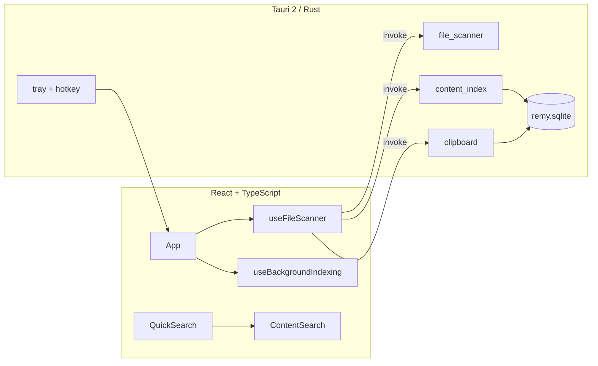

<p align="center">
  
</p>

<h1 align="center">Remy</h1>

<p align="center">
  <strong>Your second memory — files and clipboard.</strong>
</p>

<p align="center">
  A local-first macOS desktop memory app that passively captures what you touch on your computer,<br />
  keeps it searchable on your machine, and never ships your data to the cloud.
</p>

<p align="center">
  
  
  
  
</p>

---

## What is Remy?

**Remy** is a local-first macOS desktop memory app. It watches your folders and clipboard, merges everything into one searchable timeline, and extracts text from supported documents so you can find that PDF, snippet, or file path again — without uploading anything anywhere.

Built with **Tauri 2**, **React**, **TypeScript**, **Tailwind CSS**, and **Rust**, with all user data stored in **local SQLite persistence**.

This is an **active MVP / beta**: core workflows are usable end-to-end, but polish and advanced features are still in progress.

---

## Key features

### Memory & browse

- **Timeline** — unified chronological feed of files and clipboard entries
- **Memories** — browse all items in list or grid with filters and sort
- **Favorites** — pin items across sources; persisted with snapshots
- **Indexed** — dedicated page for files with extracted text and index metadata
- **Tags** — assign custom tags to any memory; filter Timeline by tag; survives rescans
- **File scanning** — passive polling of Downloads, Desktop, and Documents
- **Custom watched folders** — add any folder from the Timeline toolbar
- **Clipboard memory** — text clipboard history with **daily deduplication** (max 500 entries)
- **Image thumbnails** — 64×64 previews for png / jpg / jpeg / webp

### Search

- **Full-text search** — name, path, extension, source, tags, and indexed document text
- **Search operators** — `tag:`, `type:`, `source:` combinable with free text
- **Saved Searches** — named shortcuts in the sidebar for frequent queries
- **Tag autocomplete** — type `tag:`, `#`, or a prefix to browse tags with usage counts
- **Quick Search Overlay** — compact Spotlight-style window from anywhere on your Mac
- **Global hotkey** — `Cmd + Shift + Space` opens the overlay
- **Overlay contexts** — **All**, **Recent**, **Clipboard**, **Favorites**, **Tags**

### Content indexing

- **TXT / DOCX / PDF** — on-demand text extraction in Rust (max ~200k chars per file)
- **Manual indexing** — Index / Reindex / Clear index from the Details panel
- **Background queue** — optional automatic indexing (off by default)
- **Local persistence** — indexed text and failures cached in SQLite; validated by mtime + size

### Desktop actions

- **Open File** — launch in default app
- **Reveal in Finder** — show file location
- **Copy Path** — copy full path to clipboard
- **Details panel** — preview, index status, tags, and actions

### macOS integration

- **Menu bar mode** — tray icon with Open, Scan now, indexing toggle, stats, Quit
- **Background mode** — hide window on close; scanning and indexing keep running
- **Launch at Login** — optional autostart with hidden window

### Settings

- Folder scan toggles, poll intervals, clipboard privacy
- Background indexing scope and recovery actions
- Live statistics (clipboard, indexed files, characters)

---

## Screenshots

> Add captures under `docs/screenshots/` and uncomment when ready.

<!--  -->
<!--  -->
<!--  -->
<!--  -->

| View | Path |
|------|------|
| Timeline | `docs/screenshots/timeline.png` |
| Quick Search | `docs/screenshots/quick-search.png` |
| Indexed | `docs/screenshots/indexed.png` |
| Settings | `docs/screenshots/settings.png` |

---

## Tech stack

| Layer | Technologies |
|-------|----------------|
| **Frontend** | React 19, TypeScript, Tailwind CSS 4, Vite 8 |
| **Desktop shell** | Tauri 2 (Rust) |
| **Tauri plugins** | `fs`, `opener`, `clipboard-manager`, `dialog`, `notification`, `autostart`, `global-shortcut` |
| **Rust** | `pdf-extract`, `zip` + `quick-xml` (DOCX), `arboard`, `rusqlite` (bundled SQLite) |
| **Local persistence** | SQLite at `~/Library/Application Support/com.remy.app/remy.sqlite` |

---

## Architecture overview

React UI ↔ Tauri `invoke` commands ↔ Rust backend ↔ SQLite.



1. **Scan** — poll enabled folders and clipboard
2. **Hydrate** — restore index cache, failures, clipboard, favorites, tags from SQLite
3. **Search** — client-side filter with operator parsing (`tag:`, `type:`, `source:`)
4. **Index** — manual or background extraction; results cached locally

See [PROJECT_CONTEXT.md](./PROJECT_CONTEXT.md) and [ARCHITECTURE.md](./ARCHITECTURE.md) for details.

---

## Search examples

```
invoice type:pdf
history type:docx source:downloads
tag:edu type:docx
discord source:clipboard
type:image source:desktop
```

Tag autocomplete in Quick Search: type `tag`, `tag:`, `#`, or a prefix (`tag:e`, `#edu`) to pick a tag with memory counts.

---

## Privacy-first philosophy

| Principle | In practice |
|-----------|-------------|
| **Local-first** | All data on your Mac — no cloud sync |
| **No accounts** | No sign-up, no subscription, no remote database |
| **No telemetry** | No analytics or cloud APIs in the core product |
| **Transparent capture** | Configurable folder toggles and clear-data actions |
| **Future AI is opt-in** | Semantic search would require explicit consent |

---

## Installation

**Prerequisites:** Node.js 20+, npm, Rust ([rustup](https://rustup.rs/)), macOS [Tauri prerequisites](https://tauri.app/start/prerequisites/)

```bash
git clone https://github.com/nazar7755/Remy.git
cd Remy
npm install
```

---

## Running locally

**Browser mock (no Rust shell):**

```bash
npm run dev
```

**Full macOS app:**

```bash
npm run tauri:dev
```

**Lint / typecheck:**

```bash
npm run lint
npm run build
```

---

## Building the app

```bash
npm run tauri:build
```

Output: `src-tauri/target/release/bundle/` (`.app` on macOS).

---

## Current status

| Area | State |
|------|--------|
| **Release** | v0.1.0 MVP / beta |
| **Platform** | macOS-focused (other platforms untested) |
| **OCR image indexing** | **Postponed / disabled** — prototype exists (`OCR_INDEXING_ENABLED = false`) but turned off due to performance issues |
| **AI / semantic search** | **Planned, not implemented** — future opt-in phase with on-device embeddings |
| **Accounts / subscriptions** | **Future business roadmap** — not part of the current app |

---

## Roadmap

| Phase | Focus |
|-------|--------|
| **0 — Foundation** | ✅ Shell, scan, clipboard, indexing |
| **1 — Core** | 🚧 Tags, saved searches, overlay, tray, background mode (mostly shipped) |
| **2 — Broader capture** | Screenshots, file watchers |
| **3 — Power user** | Export, exclude lists, cross-platform installers |
| **4 — Intelligence** | Semantic search, summaries (opt-in) |
| **Business** | Accounts, subscriptions (not started) |

Full checklist: [ROADMAP.md](./ROADMAP.md)

---

## Known limitations

- macOS-first development target
- Folder **polling**, not native file system events
- Substring search only — no fuzzy or ranked results yet
- OCR disabled; image search is thumbnail/metadata only
- No semantic / embedding search yet
- No accounts, sync, or cloud features
- Background PDF indexing off by default

---

## Contributing

1. Read [PROJECT_CONTEXT.md](./PROJECT_CONTEXT.md)
2. Pick an item from [ROADMAP.md](./ROADMAP.md)
3. Match existing Tauri / mock adapter patterns

---

## License

License to be determined.

---

<p align="center">
  <sub>Remy — remember what you were working on, without giving it away.</sub>
</p>
