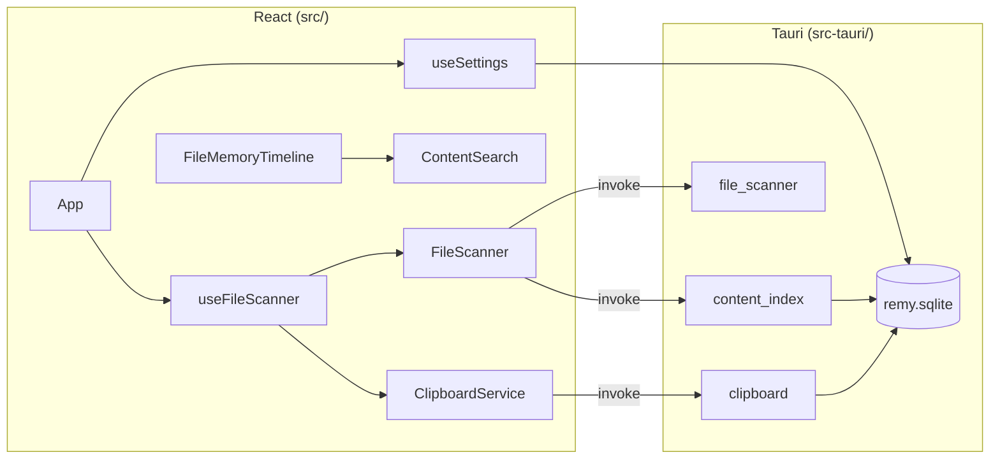

<p align="center">
  
</p>

<h1 align="center">Remy</h1>

<p align="center">
  <strong>Your second memory — files and clipboard.</strong>
</p>

<p align="center">
  A local-first desktop app that passively captures what you touch on your computer,<br />
  keeps it searchable on your machine, and never ships your data to the cloud.
</p>

<p align="center">
  
  
  
  
</p>

---

## Table of contents

- [Description](#description)
- [Features](#features)
- [Screenshots](#screenshots)
- [Tech stack](#tech-stack)
- [Architecture overview](#architecture-overview)
- [Installation](#installation)
- [Running locally](#running-locally)
- [Roadmap](#roadmap)
- [Current status](#current-status)
- [Privacy-first philosophy](#privacy-first-philosophy)
- [Contributing](#contributing)
- [License](#license)

---

## Description

**Remy** is a desktop-native “second memory” for your workflow. It watches standard folders (Downloads, Desktop, Documents) and your clipboard, merges everything into one searchable timeline, and extracts text from supported documents so you can find that PDF, snippet, or file path again—without uploading anything anywhere.

Built for knowledge workers, researchers, and anyone tired of digging through Finder or scrollback. Remy is **local-first**, **passive**, and **searchable** by design.

---

## Features

| Area | What you get |
|------|----------------|
| **Unified timeline** | Files and clipboard entries in one chronological feed with source filters |
| **Passive capture** | Folder polling + clipboard monitoring—no “save to Remy” for every item |
| **Full-text search** | Search by name, path, extension, source, and indexed document text |
| **Content indexing** | On-demand extraction for `.txt`, `.pdf`, `.docx` with disk cache (mtime/size validation) |
| **Memories browse** | List or grid view, type filters, six sort orders, detail panel |
| **Favorites** | Pin items across sources; persisted in SQLite with snapshots |
| **Indexed library** | Dedicated view of files with extracted text and index metadata |
| **Desktop actions** | Open file, reveal in Finder/Explorer, copy path |
| **Image previews** | 64×64 thumbnails for common image types (desktop build) |
| **Settings & stats** | Folder toggles, poll intervals, clipboard privacy, clear data, live statistics |
| **Dev-friendly** | Browser-only mock mode for UI work without the Rust shell |

---

## Screenshots

> Add captures under `docs/screenshots/` and uncomment the blocks below for your README on GitHub.

<!-- ### Timeline -->

<!--  -->

<!-- ### Memories -->

<!--  -->

<!-- ### Indexed -->

<!--  -->

<!-- ### Settings -->

<!--  -->

| View | Preview |
|------|---------|
| Timeline | `docs/screenshots/timeline.png` |
| Memories | `docs/screenshots/memories.png` |
| Indexed | `docs/screenshots/indexed.png` |
| Settings | `docs/screenshots/settings.png` |

---

## Tech stack

| Layer | Technologies |
|-------|----------------|
| **UI** | React 19, TypeScript, Tailwind CSS 4, Vite 8 |
| **Desktop shell** | [Tauri 2](https://tauri.app/) (Rust) |
| **Tauri plugins** | `tauri-plugin-fs`, `tauri-plugin-opener`, `tauri-plugin-clipboard-manager` |
| **Rust libraries** | `pdf-extract`, `zip` + `quick-xml` (DOCX), `arboard`, `rusqlite` (bundled SQLite) |
| **Persistence** | Local SQLite at `{data_local_dir}/com.remy.app/remy.sqlite` |

---

## Architecture overview

Remy splits a React frontend from a thin Tauri/Rust backend. The UI talks to the shell through small `invoke` commands; adapters keep browser-only dev working with mock data.



### Repository layout

```
Remy/
├── src/                 # React UI (components, hooks, services, lib)
├── src-tauri/           # Rust: commands, persistence, clipboard monitor, indexer
├── PROJECT_CONTEXT.md   # Contributor-oriented architecture notes
├── ROADMAP.md           # Detailed phased roadmap
└── README.md
```

### Data flow (high level)

1. **Scan** — Poll enabled folders every few seconds; merge with clipboard poll results.
2. **Hydrate** — Restore cached index text and clipboard history from SQLite on startup.
3. **Search** — Client-side filter across metadata and indexed/plain text.
4. **Index** — User-triggered (or future background) extraction in Rust; cache keyed by path + file stats.

For command-level detail, see [PROJECT_CONTEXT.md](./PROJECT_CONTEXT.md).

---

## Installation

### Prerequisites

- **Node.js** 20+ and **npm**
- **Rust** toolchain ([rustup](https://rustup.rs/))
- **Platform deps for Tauri** — see [Tauri prerequisites](https://tauri.app/start/prerequisites/) for macOS, Windows, or Linux

### Clone and install dependencies

```bash
git clone https://github.com/nazar7755/Remy.git
cd Remy
npm install
```

The first `tauri dev` or `tauri build` will compile the Rust crate and may take several minutes.

---

## Running locally

### Web UI only (mock data)

Useful for frontend work without the desktop shell:

```bash
npm run dev
```

Open the Vite dev server (default `http://localhost:5173`). Timeline data comes from `MockFileSystemAdapter`.

### Full desktop app (recommended)

```bash
npm run tauri:dev
```

### Production build

```bash
npm run tauri:build
```

Installers/artifacts are emitted under `src-tauri/target/release/bundle/` (platform-specific).

### Lint

```bash
npm run lint
```

---

## Roadmap

Remy is an **early prototype** (target **v0.1.0**). Work is organized in phases; the full checklist lives in [ROADMAP.md](./ROADMAP.md).

| Phase | Focus | Status |
|-------|--------|--------|
| **0 — Foundation** | Shell, scan, clipboard, indexing, mock dev | ✅ Shipped |
| **1 — Core completeness** | Memories, Favorites, Indexed, Settings, persistence | 🚧 In progress |
| **2 — Broader capture** | Custom watch folders, screenshots, optional browser history | Planned |
| **3 — Power user** | Global shortcut, tray, export, exclude lists, installers | Planned |
| **4 — Intelligence (optional)** | On-device semantic search, summaries—opt-in only | Later |

**Near-term priorities**

- Dedicated **Search** experience (saved queries, grouping, keyboard focus)
- Timeline UX: pagination, day grouping, background indexing queue
- Ranked/fuzzy search beyond substring match

---

## Current status

| Dimension | State |
|-----------|--------|
| **Release** | v0.1.0 early prototype — not production-hardened |
| **Platforms** | Tauri targets macOS, Windows, Linux; primary dev on macOS |
| **Navigation** | Timeline, Memories, Favorites, Indexed, Settings — **Search** route exists but UI is not built yet |
| **Capture** | Downloads, Desktop, Documents + clipboard text |
| **Indexing** | Manual from detail panel; cache survives restarts |
| **Cloud / accounts** | None — by design |
| **AI / LLM** | Not integrated; optional future phase with explicit opt-in |

---

## Privacy-first philosophy

Remy is built on the premise that **your memory belongs on your machine**.

| Principle | What it means in practice |
|-----------|---------------------------|
| **Local-first** | SQLite and index cache live under your OS app data directory. No sync service, no remote database. |
| **No telemetry by default** | The architecture has no cloud APIs; network use is not part of the core product story. |
| **Passive, transparent capture** | Standard folders and clipboard only—configurable toggles and clear-data actions in Settings. |
| **You control retention** | Clear clipboard history or wipe indexed content from the app; clipboard capped at 500 entries. |
| **Indexing is explicit** | Document text extraction runs when you index (or reindex)—not hidden upload pipelines. |
| **Future intelligence is opt-in** | Semantic search or summaries (Phase 4) would require explicit user consent before any network or model call. |

We treat privacy as a **product constraint**, not a marketing footnote. If a feature cannot be explained in one sentence on-device, it waits until it can.

---

## Contributing

1. Read [PROJECT_CONTEXT.md](./PROJECT_CONTEXT.md) for architecture and conventions.
2. Pick the next unchecked item in [ROADMAP.md](./ROADMAP.md).
3. Match existing patterns: Tauri vs mock adapters, snake_case Rust DTOs → camelCase TypeScript.

Issues and PRs welcome once the public repository is open.

---

## License

License to be determined. See repository settings or `LICENSE` when published.

---

<p align="center">
  <sub>Remy — remember what you were working on, without giving it away.</sub>
</p>
